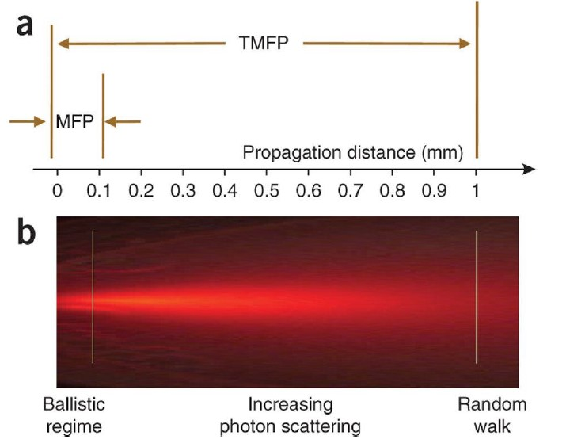

## Basic properties

- n [-]: index of refraction; e.g., 1.37
- $\mu _a$ [$cm^{-1}$]: absorption coefficient; e.g., 0.1
- $\mu _s$ [$cm^{-1}$]: scattering coefficient; e.g., 100
- g [-]: scattering anisotropy, <$cos\theta $>; e.g., 0.9

## Derived properties

- $\mu _t$ [$cm^{-1}$]: total interaction (extinction) coefficient, $\mu _a + \mu _s$
- $l _t$ [$cm$]: mean free path, $1/\mu _t$; e.g., 0.1 mm
- $\mu _s'$ [$cm^{-1}$]: reduced scattering coefficient, $\mu _s(1-g)$
- $\mu _t'$ [$cm^{-1}$]: transport interaction (extinction) coefficient, $\mu _a + \mu _s'$
- $l _t'$ [$cm$]: transport mean free path, $1/\mu _t'$; e.g., 1 mm
- $\mu _{eff}$ [$cm^{-1}$]: effective attenuation coefficient, $(3\mu _a \mu _t')^{1/2}$
- $\delta $ [cm]: penetration depth, $1 / (3\mu _a \mu _t')^{1/2}$; e.g., 5 mm

### Schematic depiction of mean free path (MFP) and transport mean free path (TMFP)

