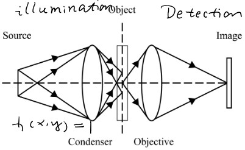
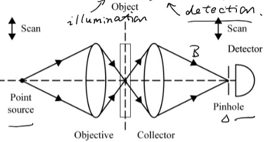
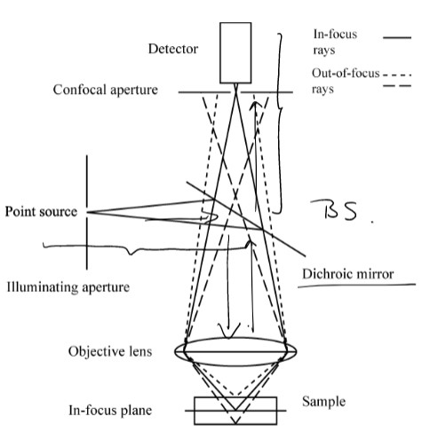
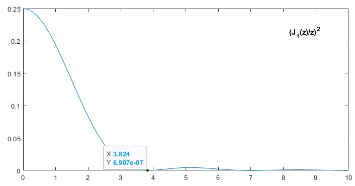
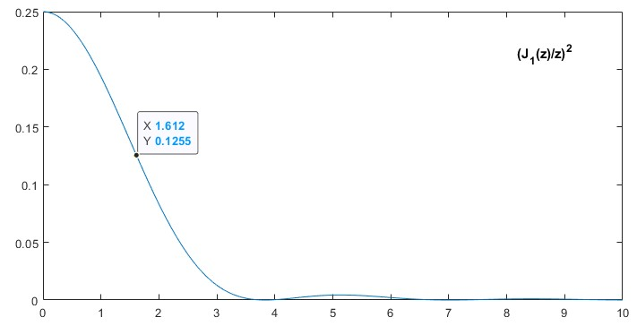

# Point Spread Fucntion and Resolution
- When a high-contrast point target is imaged, the point appears as a blurred blob in the image because any practical image system is imperfect
- The blurred blob of the geometrically perfect point (delta impluse) is PSF (inpmulse function)
- The full width at half maximum (FWHM) of the PSF is often defined as the spatial resolution

## Line spread function (LSF)
What we get if imaging a perfect line. Basically it's a summation of PSF at all points at the line
$$
LSF(x,y) = \int \int Line(x',y') PSF(x-x',y-y')dx'dy' 
$$
$Line(x,y) = 0$, when $x != 0$, and we only need $LSF(x,y)$ when $y=0$.
$$
LSF(x) = \int_{-inf}^{+inf} PSF(x,-y')dy'
$$
It doesn't matter if we flip the PSF if the integral range is -inf to +inf
$$
LSF(x) = \int_{-inf}^{+inf} PSF(x,y)dy
$$
## Edge spread function (ESF)
An edge is, for example, an image with left side being black and right side being white. It can be regarded as a lot of lines at the white side.
$$
ESF(x) = \int_0^{+inf} LSF(x-x')dx'
$$
let $x'' = x-x'$
$$
ESF(x)=\int_{-inf}^{x} LSF(x'')dx''
$$
$$
LSF(x) = \frac{d}{dx}ESF(x)
$$

## Optical transfer function (OTF)
$H(u, v) = \mathscr{F}\{PSF(x,y)\}$ is a complex that describe the system's characteristics in fourier domain. The amplitude of it is called MTF (modulation transfer function). 
$$
MTF = |H(u,v)|
$$
MTF is often 1D plotted to show the general system response with respect to frequency after integral in one axis. Or it can be alternatively computed by Fourier transformation of Line Spread Function (LSF). Ideal system has MTF as constant 1 for entire spectrum. We also use a diffraction limited MTF as a reference in optic design.

## Contrast, Signal noise ratio (SNR), Contrast Noise Ratio (CNR)
1. 
$$
Contrast = \frac{dI}{I}
$$
$I$ is the overall signal level, which consists of signal and background and noise. $dI$ is the signal. Well in some other cases, contrast is defined as 
$$
Contrast = \frac{I_{max} - I_{min}}{I_{max} + I_{min}}
$$

2.
$$
SNR = I/\sigma_n
$$
$\sigma_n$ is the standard deviation of the sigmal, which is taken as the noise.

3. 
$$
CNR = dI/\sigma_n = SNR \cdot Contrast
$$

## Depth-Resolution-Ratio

$$
DRR = Depth / Axial Resolution
$$

# Wide-field microscope 
Transmissive wide-field imaging:

## Definition:
1. illumination: flood illumination and illumination on entire FOV simultaneous
2. detection: image entire FOV simultaneously 
## Illumination:
- Way 1: Direct mapping: use a lens to direct relay the light source to object plane

    light source |---l1---| lens |---l2---| object
- Way 2: [Kholer illumination](https://en.wikipedia.org/wiki/K%C3%B6hler_illumination): put the object at the back focal plane of the lens, so that the object is illuminated by the fourier transformation of the light source

    light source |---f---| lens |---f---| object

    light source |---f---| lens1 |---f---|---l1---| lens2 |---l2---| object

## Detection:
1. Objective + tubelens, could be a (4f) telecentric system where the stop is the back aperture of the objective (together in the objective barrel)
## Resolution:
1. lateral resolution: ONLY determined by the objective lens _if the illumination fills the entire NA of the detection system_
2. axial resolution: 
    
    - point object: axial resolution is provided
    - planar object: axial resolution is NOT provided

    P.S. Honestly I don't fully understand the difference between a point and planar object here but I don't think it's important. Normally we will quantify the spatial resolution using sub-diffraction point object in microscopy field.

# Confocal microscope
Transmissive confocal imaging:

Reflective confocal imaging:

## Illumination:
Only one point is illuminated at a time. Rasterized scan.

## Detection: 
A pinhole is used and positioned at the conjugate plan of the illuminated object to minimize the out of focus light.

## Resolution:

1. lateral resolution: Provided by both illumination (because the illumination is not uniform but with structure) and detection optics
2. axial resolution: Provided for both point and planar objects 

## Penetration 
Penetration of hundreds of micrometers into scattering biological tissues. Less than one transport mean free path.

# PSF of a Lens (Gu book Chapter 3)
It can be computed by the Hankel function.
$$
h(u,v) = 2 \int exp(\frac{i}{2}u\rho^2)J_0(\rho v)\rho d\rho
$$

$$
u = \frac{8\pi sin^2(\alpha /2 )}{\lambda _0} z, \ 
nsin(\alpha)=NA, \ 
v = \frac{2\pi sin(\alpha)}{\lambda _0}r \ 
$$

where $\rho$ is normalized radial coordinate at the exit pupil, which ranges in [0,1]. $\alpha$ is the angle of the light cone entering the lens emitted from the object, which is associated with NA and regarded as constant due to a shallow depth of interest. $ r $ is the radius of the subject in FOV in polar coordiante.

## Image formation in coherent and incoherent imaging
### Coherent imaging:
$$
I_c = |f*h|^2
$$
### Incoherent imaging (e.g. fluorescent imaging):
$$
I_{ic} = |f|^2 * |h|^2
$$

## Lateral PSF:

$$
h(0, v) = 2 \int J_0(\rho v)\rho d\rho = 2\frac{J_1(v)}{v}
$$

## Axial PSF:

$$
h(u, 0) = 2 \int exp(\frac{i}{2}u\rho^2))\rho d\rho
=exp(iu/4)sinc(\frac{u}{4\pi})
$$
where $sinc(x) = \frac{sin(\pi x)}{\pi x }$

## 1. Wide-field imaging (which is incoherent):  
$$
PSF = |h_{detection}|^2
$$
### Lateral PSF
$$
PSF = |h(0,v)|^2=4(\frac{J_1(v)}{v})^2
$$
### Axial PSF
$$
PSF = |h(u,0)|^2 = sinc^2(\frac{u}{4\pi })
$$

## 2. Confocal imaging (which is incoherent):
$$
PSF = |h_{illumination} \cdot h_{detection}|^2
$$
__Derivation__:

For pixel of image $I$ at location $t$, we should translate the sample $E(x)$ before the illumination PSF $h_i(x)$ and detection PSF $h_d(x)$ 
$$
I(t) = (E(x-t) \cdot h_i(x)) * h_d(x)|_{x=0} = E(-x) * (h_i(x) \cdot h_d(-x))
$$
$$
PSF = (h_i(x) \cdot h_d(-x)) 
$$
In the derivation above, we multiply the illumination with the sample because the illumination is static. (It will have same conclusion if we scan laser and pinhole, rather than scanning sample. But we only consider the latter case here) We have a $x=0$ at the end of the convolution because we place a pinhole in conjugate to the illumination.

In the following discussion, we simplify it by taking same function for both illumination and detection.
$$
PSF = |h|^4
$$
### Lateral PSF
$$
PSF = |h(0,v)|^4=16(\frac{J_1(v)}{v})^4
$$
### Axial PSF
$$
PSF = |h(u,0)|^4 = sinc^4(\frac{u}{4\pi })
$$

## 3. Resolution quantification:
### 1. Rayleigh criterion:
- Lateral: $0.61 \lambda / NA$
- Axial: $2 \lambda /NA^2$

__Derivation for lateral__:

Rayleigh criterion argued that the distance between two resolvable points is the distance from the center to the first local minimal intensity in Airy disk. Consider the $(\frac{J_1(v)}{v})^2$ in the expression of lateral PSF $|h(0,v)|^2=4(\frac{J_1(v)}{v})^2$. 

$$
v \approx 3.824=\frac{2\pi sin(\alpha)}{\lambda _0}r
$$
$NA=nsin(\alpha )$, thus 
$$
r \approx 0.61*\frac{\lambda _0 }{NA}
$$

### 2. Full Width at Half Maximum (FWHM): 
- Lateral: 
    - For __confocal__:  $0.37 \lambda / NA$
    - For __wide-field__:  $0.51 \lambda /NA$

- Axial: 
    - For __confocal__: $1.3 \lambda /NA^2$
    - For __wide-field__: $1.8 \lambda / NA^2$ (for point objects only)
- Ratio:
$$
\frac{Resolution(axial)}{Resolution(lateral)} = \frac{3.6}{NA}
$$

__Derivation for lateral for wide-field__:

Consider the $(\frac{J_1(v)}{v})^2$ in the expression of lateral PSF $|h(0,v)|^2=4(\frac{J_1(v)}{v})^2$. 

$$
v \approx 1.612=\frac{2\pi sin(\alpha)}{\lambda _0}r
$$
thus 
$$
FWHM = 2r \approx 0.51*\frac{\lambda _0 }{NA}
$$

