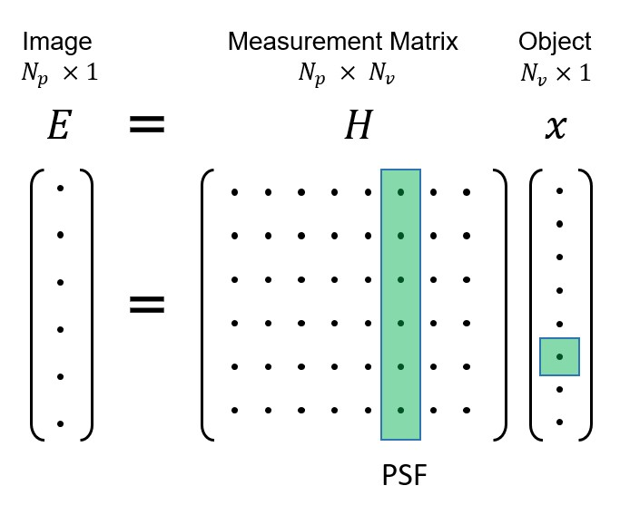

# Richardson-Lucy Deconvolution

## What is RL-Deconvolution

Optic imaging system can be analyzed as a linear system described by its impulse function, the point spread function (PSF). Due to diffraction limit and optic aberration, we can only measure degraded image from the sensor. But if we know the PSF as a prior, RL-Deconvolution helps us solve the reverse problem and restore the 'perfect' image.

The system is modeled as

$$
E = Hx
$$

where $E$ is the expected value at each pixel of camera sensor and $x$ is the ground truth in object space we are trying to solve. Both are in vectorized format of the original 2D or 3D space. $H$ is the measurement matrix which maps the input and output, which characterizes the system, just like any linear system model. 

But specifically in imaging model, an intuitive interpretation of $H$ can be related to PSF by looking at each column: this is what we will get at the sensor space if we put an impulse signal (e.g. a voxel with value 1) at a specific position in the object space. This is PSF. The calculation of the forward model $Hx$ can thus be computed via convolution. 



We can also look at $\hat x = H^TE$. The resulted output $\hat x$ has the same dimension of $x$ but it is not a inverse transormation. Each row of $H^T$ is the corresponding PSF of the a pixel in the output $\hat x$. If we multiply this PSF to the sensor space $E$, it works like a "sensing kernel" that gathers information from all the sensor pixels affected by this PSF. It "back projects" the sensor space to object space. __Mathmatically this operation can be done by correlation, which is convolution with spatially flipped kernel__ $PSF(-x,-y)$.

RL deconvolution assumes the dominating noise is shot noise. Therefore the probability of measuring signal $m$ for expected values $E$ can be given by
$$
P(m|E) = \prod_{i}Poisson(E_i)=\prod_{i}\frac{E_i^{m_i}e^{-E_i}}{m_i!} 
$$
The following derivation is copied from [Wiki](https://en.wikipedia.org/wiki/Richardson%E2%80%93Lucy_deconvolution).

[todo]

which yields
$$
\hat x_{new} = \hat x_{old}H^T(\frac{m}{H\hat x_{old}})/H^T1
$$
This is the iterative scheme we are going to implement in the code. $m$ is what we measure from the sensor, the degraded image. $H$ is a prior knowledge we either simulate or measure as the PSF of the system. Note that
1. $H^T1$ is a vector with the dimension of $x$, each entry of which is a summation of the PSF. Usually we could normalize PSF to its overall intensity before iteration to get rid of this term.
2. $\hat x$ could be initialized by ones or $m$, depending on the specific application and performance.
3. $H$, the PSF, is not necessarily shift-invariant, although shift-invariance is assumed in many system. If it is, then the entire computation is simplified as convolving with one single PSF. If it is not, we need to design a process that convolves different parts of signals with their corresponding PSFs.

## Implement RL deconvolution in a simple image deblur task

 


A gaussian blur kernel is used to degrade the image. The PSF has been normalized. 
```
img = imread('cameraman.tif');
PSF = fspecial('gaussian', 51, 2);
PSF = PSF ./ sum(PSF(:));
img_blur = conv2(img, PSF, 'same');
```
We can implement the deconvolution exactly like the math formula. The initialization in this experiment does not bring any difference. And we can observe artifacts at the border of the reconstructed image.
```
function [result, err] = RL_deconv(image, PSF, iters)    
    err = zeros(1,iters);
    image = double(image);
    PSF = double(PSF);
    PSF_hat = imrotate(PSF, 180);
    Xguess = image;
%     Xguess = ones(size(image));
    for i = 1:iters        
        HXguess = conv2(Xguess,PSF,'same');                %compute Hx      
        error = image./HXguess;                            %compute m/(Hx)     
        error(isnan(error)) = 0;error(isinf(error)) = 0;error(error < 0) = 0;
        HTerror = conv2(error,PSF_hat,'same');             %compute Ht m/(Hx)
        Xguess = Xguess.*HTerror;                          %update the estimate     
        err(i) = mean(error(:));       
    end
    result = Xguess;
end

```


Alternatively but not supported mathmatically, we can back project both measurement $m$ and estimate $Hx$ before dividing them for the error. This gives a cleaner restoration.

```
function [result, err] = RL_deconv(image, PSF, iters)    
    err = zeros(1,iters);
    image = double(image);
    PSF = double(PSF);
    PSF_hat = imrotate(PSF, 180);
    Xguess = image;
%     Xguess = ones(size(image));
    for i = 1:iters       
        HXguess = conv2(Xguess,PSF,'same'); 
        HTHXguess = conv2(HXguess, PSF_hat, 'same');
        HTimage = conv2(image, PSF_hat, 'same');
        error = HTimage ./ HTHXguess;
        Xguess = Xguess .* error;        
        err(i) = mean(error(:));       
    end
    result = Xguess;
end
```


## Implement RL deconvolution in Fourier Light Field microscope, a shift-variant case
The Richardson Lucy deconvolution is actually very versatile that it also solves the system that has shift-variant PSF and input/output with different dimensions. For example, in light field microscope and some PSF engineering system, signals at different depths have different PSFs. They integrate on the 2D sensor plane as the final measurement. Through deconvolution, we are able to restore the 3D space, therefore achieving snapshot 3D imaging. 

The iterative scheme will always stay the same and the only thing we need to change is the forward and backward projection. Thus, we can clean the codes by writing a solver first and plug in the matched forward and backward function for each of our system.
```
function [estimate, err] = RL_solver(img, VolumeGuess, forward_func, backward_func, iter)
    err = zeros(iter,1);  
    volGuess = VolumeGuess;
    for t=1:iter
        tic;
                
        fpj = forward_func(volGuess);
        errorBack = img./fpj;
        errorBack(isnan(errorBack)) = 0;errorBack(isinf(errorBack)) = 0;errorBack(errorBack < 0) = 0;
        bpjError = backward_func(errorBack);
        err(t) = mean(bpjError(bpjError>0),'all');        
        volGuess = volGuess .* bpjError;
        
        ttime = toc;
        fprintf(['iter ' num2str(t) ' | ' num2str(iter) ', took ' num2str(ttime) ' secs\n']);        
    end
    estimate = volGuess;
    fprintf('Done.\n');
end
```
For example, an example forward function of fourier light field microscope is as followed. We simply choose PSF at each depth to convolve it with the corresponding slice in the volume. Similarly, in the backward function, we will convolve the 2D sensor space with different __flipped__ PSF to get each slice in the 3D object space. 
```
function forward_projection = FLFM_forward(vol, H)
  
    [resolution, ~, ndepth] = size(H);

    fpj = zeros(resolution, resolution);
    for p = 1:ndepth
%             temp = conv2(vol(:,:,p),H(:,:,p),'same');
        temp = real(ifft2(fft2(vol(:,:,p)).*fft2(ifftshift(H(:,:,p)))));
        fpj(v,:) = fpj(v,:) + temp;
    end
    forward_projection = fpj;   
end
```
```
function backward_projection = FLFM_backward(measurement, Ht)
    
    [resolution, ~, ndepth] = size(Ht);

    bpj = zeros(resolution, resolution, ndepth);
    for p = 1:ndepth
        bpj(:,:,p) = real(ifft2(fft2(measurement).*fft2(ifftshift(Ht(:,:,p)))));
    end   
    backward_projection = bpj;
    
end
```

## Reference
1. Biggs, D. S. C. & Andrews, M. Acceleration of iterative image restoration algorithms. Appl. Opt., AO 36, 1766–1775 (1997).
2. Broxton, M. et al. Wave optics theory and 3-D deconvolution for the light field microscope. Opt. Express, OE 21, 25418–25439 (2013).
3. Stefanoiu, A. et al. Artifact-free deconvolution in light field microscopy. Opt. Express, OE 27, 31644–31666 (2019).

