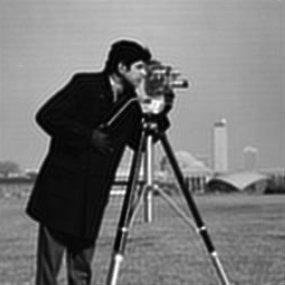

# Richardson-Lucy Deconvolution

## What is RL-Deconvolution

Optic imaging system can be analyzed as a linear system described by its impulse function, the point spread function (PSF). Due to diffraction limit and optic aberration, we measure degraded image from the sensor. If we know the PSF as a prior, RL-Deconvolution helps us solve the reverse problem and restore the 'perfect' image.

The system can be modeled as

$$
E = Hx
$$

where $E$ is the expected value at each pixel of entire camera sensor and $x$ is the ground truth in object space we are trying to solve. Both are in vectorized format of the original 2D or 3D space. $H$ is the measurement matrix which maps the input and output, which characterizes the system, just like any linear system model. 

[todo]


But specifically in imaging model, an intuitive interpretation of $H$ can be related to PSF by looking at each column of $H$: this is what we will get at the entire sensor if we put an impulse signal (e.g. a voxel with value 1) at a specific position in the object space. And this is exactly what we call a PSF. The calculation of the forward model $Hx$ can thus be computed via convolution if we know PSF as a prior. 

We can also look at $\hat x = H^TE$. The resulted output $\hat x$ has the same dimension of $x$ but it is not a inverse transormation. Each row of $H^T$ is the PSF of the corresponding pixel in the output $x$. If we multiply this PSF to the entire sensor space, it works like a "sensing kernel" that tries to gather information from all the positions in the sensor space, which could have been affected by the corresponding pixel in the output $x$. And it assigns this gathered information to the output, which is used as "back projection" in RL deconvolution to convert sensor space back to object space. __Mathmatically this operation can be done by correlation, which is convolution with spatially flipped kernel__ $PSF(-x,-y)$.

RL deconvolution assumes the dominating noise is shot noise. Therefore the probability of measuring signal $m$ for expected values $E$ can be given by
$$
P(m|E) = \prod_{i}Poisson(E_i)=\prod_{i}\frac{E_i^{m_i}e^{-E_i}}{m_i!} 
$$
The following derivation is copied from [Wiki](https://en.wikipedia.org/wiki/Richardson%E2%80%93Lucy_deconvolution).

[todo]

which yields
$$
\hat x_{new} = \hat x_{old}H^T(\frac{m}{H\hat x_{old}})/H^T1
$$
This is the iterative scheme we are going to implement in the code. $m$ is what we measure from the sensor, the degraded image. $H$ is a prior knowledge we either simulate or measure as the PSF of the system. Note that
1. $H^T1$ is a vector with the dimension of $x$, each entry of which is a summation of the PSF. Normally we could normalize PSF to its intensity summation before iteration to get rid of this term.
2. $\hat x$ could be initialized by ones or $m$, depending on the specific application and performance.
3. $H$, the PSF, is not necessarily shift-invariant, although shift-invariance is assumed in many system. If it is, then the entire computation is simplified as convoling with one single PSF. If it is not, we need to design a process that convolutes different parts of signals with their corresponding PSFs.

## Implement RL deconvolution in a simple image deblur task

 


A gaussian blur kernel 
```
img = imread('cameraman.tif');
PSF = fspecial('gaussian', 51, 2);
PSF = PSF ./ sum(PSF(:));
img_blur = conv2(img, PSF, 'same');
```

```
function [result, err] = RL_deconv(image, PSF, iters)    
    err = zeros(1,iters);
    image = double(image);
    PSF = double(PSF);
    PSF_hat = imrotate(PSF, 180);
    Xguess = image;
%     Xguess = ones(size(image));
    for i = 1:iters        
        HXguess = conv2(Xguess,PSF,'same');                %compute Hx      
        error = image./HXguess;                            %compute m/(Hx)     
        error(isnan(error)) = 0;error(isinf(error)) = 0;error(error < 0) = 0;
        HTerror = conv2(error,PSF_hat,'same');             %compute Ht m/(Hx)
        Xguess = Xguess.*HTerror;                          %update the estimate     
        err(i) = mean(error(:));       
    end
    result = Xguess;
end

```


```
function [result, err] = RL_deconv(image, PSF, iters)    
    err = zeros(1,iters);
    image = double(image);
    PSF = double(PSF);
    PSF_hat = imrotate(PSF, 180);
    Xguess = image;
%     Xguess = ones(size(image));
    for i = 1:iters       
        HXguess = conv2(Xguess,PSF,'same'); 
        HTHXguess = conv2(HXguess, PSF_hat, 'same');
        HTimage = conv2(image, PSF_hat, 'same');
        error = HTimage ./ HTHXguess;
        Xguess = Xguess .* error;        
        err(i) = mean(error(:));       
    end
    result = Xguess;
end
```


[todo]

## Implement RL deconvolution in Fourier Light Field microscope, a shift-variant case

